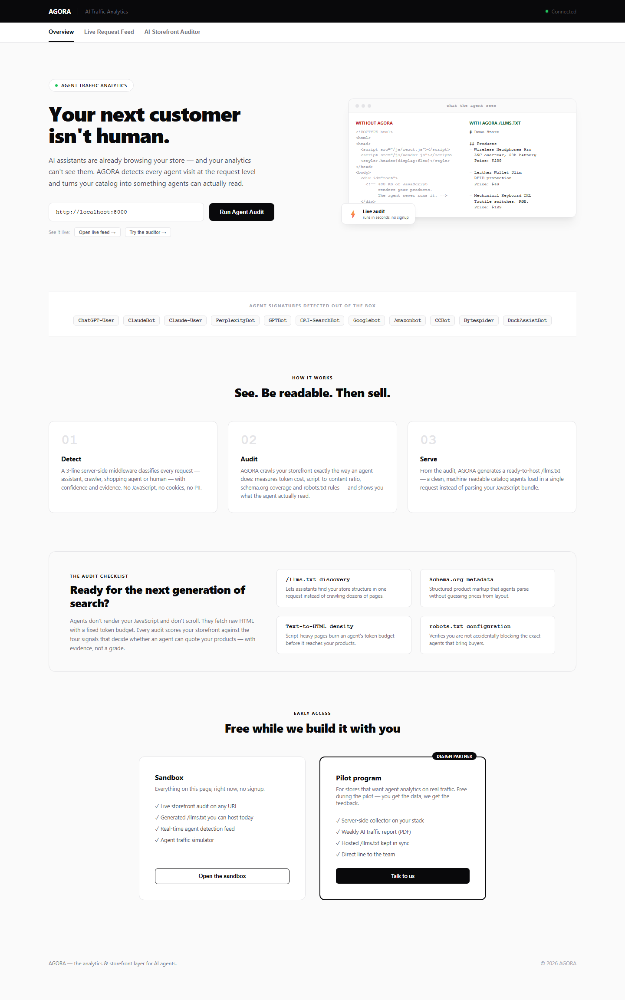
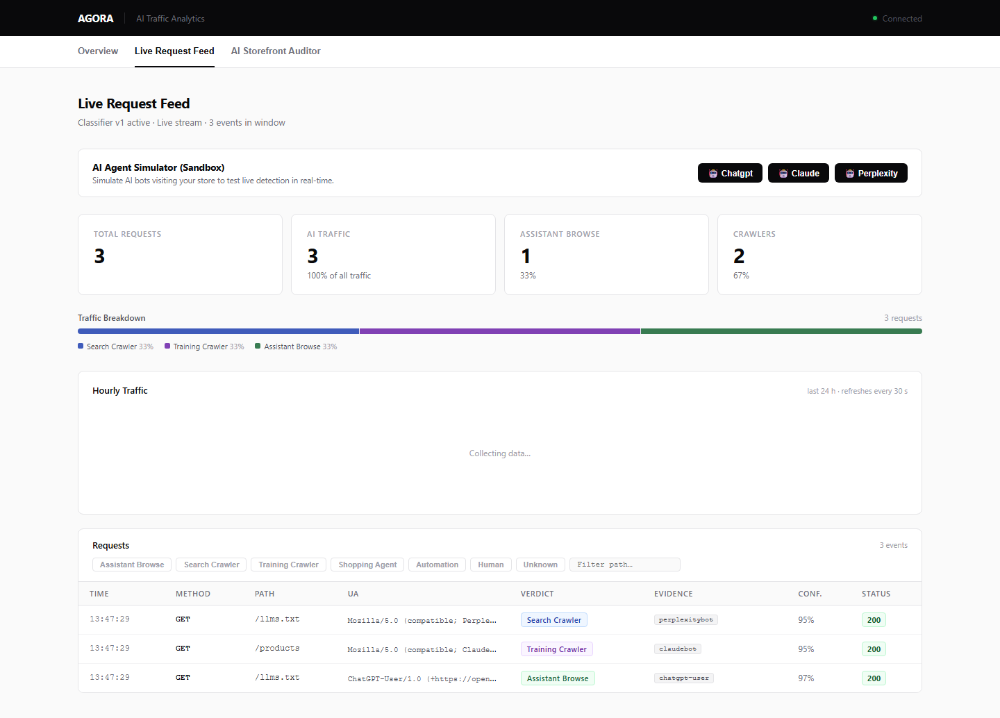
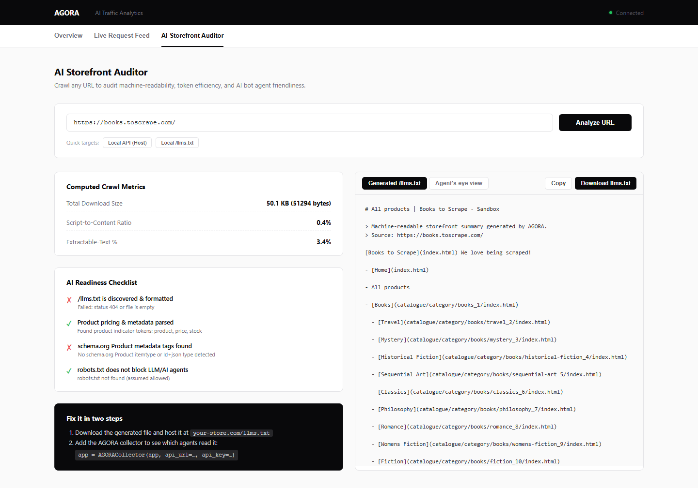

# AGORA — AI Agent Traffic Analytics & Storefront Auditor

> **Personal Showcase Project** — An end-to-end platform for detecting AI agent traffic on e-commerce storefronts, auditing machine readability, and serving automated LLM-optimized catalog data (`/llms.txt`).

---

## 💡 Concept & Vision

Classic web analytics (Google Analytics, Mixpanel) rely on client-side JavaScript execution, missing 100% of non-human traffic. Bot protection layers (Cloudflare, Akamai) treat all non-human crawlers as threats and block them.

Neither solves the modern problem: **AI Shopping Agents** (ChatGPT, Claude, Perplexity, Apple Intelligence) visit online stores to find products, compare prices, and recommend items to buyers.

**AGORA** fills this gap by providing:
1. **Server-Side Visibility**: Real-time detection and classification of AI agent requests without relying on JavaScript.
2. **Storefront AI Readability Audit**: Crawling and evaluating catalog visibility, token efficiency, script-to-content ratios, and semantic structure.
3. **Automated `/llms.txt` Delivery**: Generating clean, machine-readable markdown catalogs formatted specifically for AI search engines.

---

## 🛠️ Architecture & Tech Stack

AGORA is built as a full-stack, production-grade system:

- **Backend**: Python 3.12+, FastAPI, Uvicorn, Pydantic v2, Async SQLite / PostgreSQL, `httpx`, Pytest.
- **Frontend**: React 19, TypeScript, Vite, Modern CSS & Glassmorphism design system.
- **Collector Integration**: Custom ASGI middleware package (`agora-collector`) for zero-overhead server-side request capture.
- **Testing & Quality**: 130+ unit/integration test suite, Playwright End-to-End browser tests.
- **Deployment**: Docker & Docker Compose containerized stack.

---

## 📷 UI Showcase

| Landing Page | Live Request Feed | Storefront Auditor |
|---|---|---|
|  |  |  |

---

## ⚡ Core Engineering Highlights

### 1. Server-Side Request Classification Engine
- Detects incoming AI crawlers, shopping agents, and automated bots using hot-updatable YAML signature definitions (`server/signatures/`).
- Classifies requests into structured verdicts (`assistant_browse`, `crawler_search`, `crawler_training`, `shopping_agent`, `human`) with evidence logs and confidence scores.
- Streams live traffic events directly to the dashboard over Server-Sent Events (SSE).

### 2. Deep Web & Catalog Auditor
- Fetches target storefronts, strips script junk, and computes extractable text ratios to prevent LLM token quota waste.
- Scans Shopify `/products.json` or XML sitemaps to compare raw store catalog ground-truth against what AI agents can actually parse.
- Generates compliant `/llms.txt` catalog summaries on the fly.

### 3. Privacy & Fail-Fast Security
- **Salted IP Hashing**: Hashes and truncates client IPs to maintain privacy by design (GDPR compliant).
- **Fail-Fast Secret Verification**: Refuses to start in production if insecure default keys or short salts are detected.
- **Fail-Open Collector**: Ensures merchant store performance is never impacted by logging network operations.

---

## 📂 Repository Structure

```
server/       FastAPI application — Ingest API, Classifier, Web Auditor, Lead Capture, Reports
dashboard/    React 19 + TypeScript SPA (Overview, Live Feed, Auditor, Intelligence)
collector/    Standalone ASGI middleware package for Python web apps
deploy/       Docker Compose configuration for containerized deployment
```

---

## 📄 License

This project is open-sourced under the [GNU AGPLv3 License](LICENSE).
